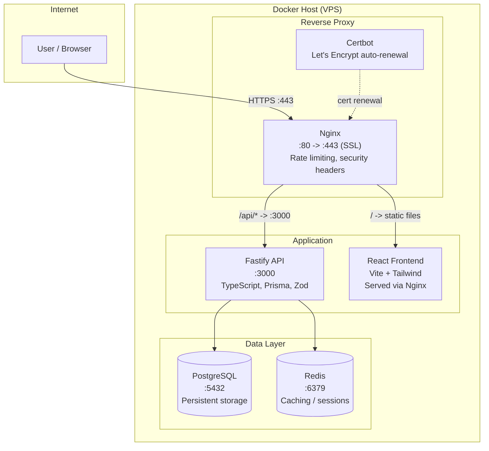

# Architecture

## Service Topology

## Container Breakdown

| Service | Image | Purpose |
|---|---|---|
| nginx | nginx:1.25-alpine | Reverse proxy, SSL termination, rate limiting |
| api | node:20-alpine (custom) | Fastify HTTP server with Prisma ORM |
| frontend | node:20-alpine (custom) | React SPA built with Vite |
| postgres | postgres:15-alpine | Relational database |
| redis | redis:7-alpine | In-memory cache |
| certbot | certbot/certbot | SSL certificate issuance and renewal |

## Network Flow

1. User connects to `https://domain.com`
2. Nginx terminates SSL, applies security headers and rate limiting
3. API requests (`/api/*`) are proxied to the Fastify container
4. Static assets are served directly by Nginx
5. Fastify queries PostgreSQL via Prisma ORM
6. Redis caches frequent queries and session data
7. Certbot runs periodically to renew SSL certificates

## Key Configurations

- All services communicate over an internal Docker network (`app-network`)
- Only Nginx exposes ports to the host (`:80`, `:443`)
- Database credentials and secrets are injected via `.env` file
- Health check endpoints at `/health` and `/api/health`
